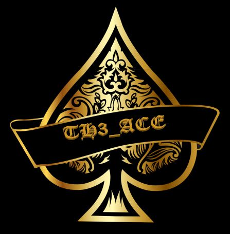

.. raw:: html

   <h1 align="center">

.. image:: ./pictures/SUDO KILLER2.JPG

.. raw:: html

    
   KILLER PROJECT
    

.. image: https://img.shields.io/github/last-commit/TH3xACE/SUDO_KILLER?style=plastic
   :target: https://github.com/TH3xACE/SUDO_KILLER
   :alt: Last Commit

.. image::https://img.shields.io/microbadger/image-size/th3xace/sudo_killer_demo?style=plastic
    :target: https://hub.docker.com/r/th3xace/sudo_killer_demo
    :alt: Docker Size

.. image:: https://img.shields.io/docker/cloud/build/koutto/jok3r.svg
    :target: https://hub.docker.com/r/th3xace/sudo_killer_demo
    :alt: Docker Build Status
	
.. raw:: html

   </h1>

#sudo exploitation #Abusing sudo #Exploiting Sudo

If you like the tool and for my personal motivation so as to develop other tools please a +1 star * 

The tool can be used by pentesters, system admins, CTF players, students, System Auditors and trolls :).

.. contents:: 
    :local:
    :depth: 1

=============
INTRO
=============

**WARNING: SUDO_KILLER is part of the KILLER project. SUDO_KILLER is still under development 
and there might be some issues, please create an issue if you found any. **

**Other tool will be added to the KILLER project in the coming months so stay tuned up. Also ideas, bug reports, contributions are more than welcome !**

=============
Overview
=============

*SUDO_KILLER* is a tool that can be used for privilege escalation on linux environment by abusing SUDO in several ways. 
The tool helps to identify misconfiguration within sudo rules, vulnerability within the version of sudo being used (CVEs and vulns) 
and the use of dangerous binary, all of these could be abused to elevate privilege to ROOT.

*SUDO_KILLER* will then provide a list of commands or local exploits which could be exploited to elevate privilege. 
It is worth noting that the tool does not perform any exploitation on your behalf, the exploitation will need to be performed manually and this is intended.

=============
Features
=============

Some of the checks/functionalities that are performed by the tool. 
--------------------------
* **Misconfigurations**
* **Dangerous Binaries**
* **Vulnerable versions of sudo - CVEs**
* **Dangerous Environment Variables**
* **Credential Harvesting**

=============
Usage
=============

Example
--------------------------

 ./sudo_killer.sh -c -r report.txt -e /tmp/

Arguments
--------------------------
* **-k : Keywords**
* **-e : export location (export /etc/sudoers)**
* **-c : include CVE checks with respect to sudo version**
* **-s : supply user password for sudo checks (not recommended ++except for CTF)**
* **-r : report name (save the output)**
* **-h : help**

CVEs check
--------------------------

To update the CVE database : run the following script ./cve_update.sh

Providing password (**Important**)
--------------------------

If you need to input a password to run sudo -l then the script will not work if you don't provide a password with the argument -s.

Notes
--------------------------

**NOTE : sudo_killer does not exploit automatically by itself, it was designed like this on purpose but check for misconguration and vulnerabilities and then propose you the following (if you are lucky the route to root is near!) :

* **a list of commands to exploit** 
* **a list of exploits**
* **some description on how and why the attack could be performed**

=============
Why is it possible to run "sudo -l" without a password?
=============
By default, if the NOPASSWD tag is applied to any of the entries for a user on a host, he or she will be able to run "sudo -l" without a password. This behavior may be overridden via the verifypw and listpw options.

However, these rules only affect the current user, so if user impersonation is possible (using su) sudo -l should be launched from this user as well.

Sometimes the file /etc/sudoers can be read even if sudo -l is not accessible without password.

============
Docker - Vulnerable testing environment
============
**IMPORTANT: The recommended way to test the tool is to use the docker image created on purpose for the testing. The image contained several vulnerabilities and misconfigurations related to
the usage of SUDO.

Everything is tested from the Docker container available on Docker Hub !**

.. image:: https://raw.githubusercontent.com/koutto/jok3r/master/pictures/docker-logo.png

A Docker image is available on Docker Hub and automatically re-built at each update: 
https://hub.docker.com/r/th3xace/sudo_killer_demo . It is initially based on official debian:jessie Docker image (debian:jessie).

.. image::https://img.shields.io/microbadger/image-size/th3xace/sudo_killer_demo ?style=plastic
    :target: https://hub.docker.com/r/th3xace/sudo_killer_demo
    :alt: Docker Size

1. **Pull SUDO_KILLER_DEMO Docker Image from the docker hub:**

    .. code-block:: console

        service docker start 
	docker pull th3xace/sudo_killer_demo
	docker run --rm -it th3xace/sudo_killer_demo		

2. **Build locally from Dockerfile :**

    .. code-block:: console

        service docker start 
	git clone https://github.com/TH3xACE/SUDO_KILLER.git 
	cd SUDO_KILLER 
	docker build -t th3xace/sudo_killer_demo . 
	docker run --rm -it th3xace/sudo_killer_demo

============
Demos
============

Several videos are provided below with different scenarios of exploitation.

The playlist url: https://www.youtube.com/watch?v=Q8iO9mYrfv8&list=PLQPKPAuCA40FMpMKWZLxQydLe7rPL5bml

* **Video 1 : Docker - Setup vuln environment** 

.. image:: pictures/video-01.png
   :target: https://youtu.be/Q8iO9mYrfv8

* **Video 2 : Scenario 1 - CVE exploitation** 

.. image:: pictures/video-02.png
   :target: https://youtu.be/CpLJ9kY6eig

* **Video 3: Scenario 2 - Dangerous Bins** 

.. image:: pictures/video-02.png
   :target: https://youtu.be/cELFVC6cTyU

* **Video 4: Scenario 3 - Misconfiguration (Wildcard)** 

.. image:: pictures/video-02.png
   :target: https://youtu.be/rKA55mis8-4

* **Video 5: Scenario 4 - Misconfiguration (Excessive Rights)** 

.. image:: pictures/video-02.png
   :target: https://youtu.be/s1KK6go1nGY
   
* **Video 6: Scenario 5 - Misconfiguration (Missing scripts)** 

.. image:: pictures/video-02.png
   :target: https://youtu.be/zsxvsSYz4as

* **Video 7: Scenario 6 - Credentials Harvesting** 

.. image:: pictures/video-02.png
   :target: https://youtu.be/i7ixN0sv2Qw  
   
* **Video 8: Scenario 7 - Token Abuse** 
will be available soon

* **Video 9: Scenarion 8 - Environment Variable Exploitation** 
will be available soon

   
============
#whoami
============

Author
----------------------------

Project
----------------------------
.. image:: ./pictures/killer_project.jpg
    :width: 700px
    :alt: Project

=============
Coming functionality and improvement
=============
* **Sudo token abuse**
* **Dealing with aliases**
* **Credentials harvesting - done**
* **Improve the way information on potential vuln and exploit are presented - partially done**
* **If you want me to add any other one... please submit an issue**

=============
Credits
=============
The script was developed from myself with the help of online resources found on github and in the wild. Credits also to the authors of the exploits related to CVEs.
The authors information and links can be found in the exploit and in the notes provided when running the tool. Special kudos to Vincent Puydoyeux, who gave me the idea to develop this tool. 

=============
Disclaimer
=============
This script is for Educational purpose ONLY. Do not use it without permission. The usual disclaimer applies, especially the fact that me (TH3xACE) is not liable for any damages 
caused by direct or indirect use of the information or functionality provided by these programs. The author or any Internet provider bears NO responsibility for content or misuse 
of these programs or any derivatives thereof. By using these programs you accept the fact that any damage (dataloss, system crash, system compromise, etc.) caused by the use of 
the script is not my responsibility.

